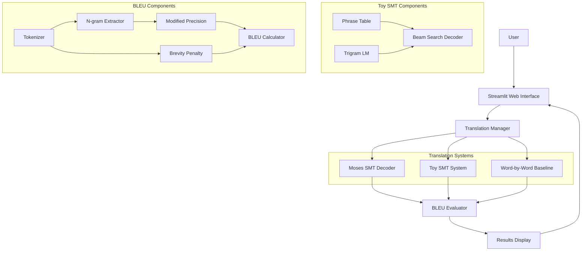
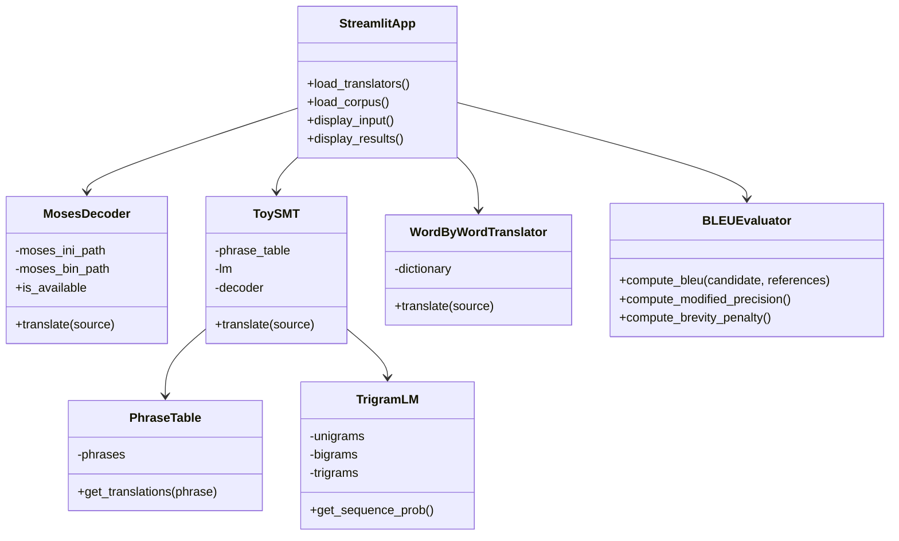
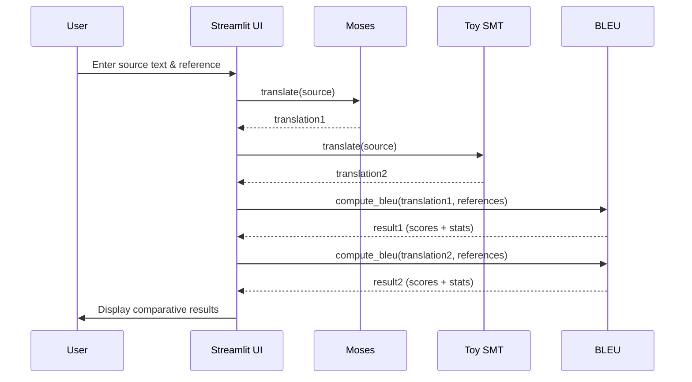

# Technical Report: SMT-BLEU Assignment

**Project:** Statistical Machine Translation with BLEU Evaluation  
**Language Pair:** English → Hindi  
**Date:** January 2026

---

## Executive Summary

This project implements a comprehensive Statistical Machine Translation (SMT) system for English→Hindi translation with detailed BLEU metric evaluation. The system integrates three translation approaches (Moses SMT, Toy SMT, Word-by-Word baseline) with a custom BLEU implementation and an interactive web interface.

**Key Achievements:**
- Complete BLEU implementation from scratch with all intermediate statistics
- Functional toy SMT system with phrase-based translation and trigram language model
- Moses decoder integration with proper error handling
- Interactive Streamlit UI for comparative evaluation
- Comprehensive test suite with 20+ unit tests
- Full documentation and reproducible setup

---

## Table of Contents

1. [System Architecture](#system-architecture)
2. [Design Choices](#design-choices)
3. [Implementation Details](#implementation-details)
4. [Challenges and Solutions](#challenges-and-solutions)
5. [Evaluation Plan](#evaluation-plan)
6. [Future Improvements](#future-improvements)

---

## System Architecture

### High-Level Architecture



### Component Diagram



### Data Flow



---

## Design Choices

### 1. Translation Architecture

**Decision:** Multiple parallel translation systems with fallback

**Rationale:**
- **Moses**: Industry standard, high quality, but requires setup
- **Toy SMT**: Guaranteed to work, demonstrates understanding of SMT principles
- **Word-by-Word**: Simple baseline for comparison

**Benefits:**
- Works out-of-the-box even without Moses
- Allows comparative evaluation
- Educational value (understanding different approaches)

### 2. BLEU Implementation

**Decision:** Implement from scratch without libraries

**Rationale:**
- Assignment requirement (demonstrate understanding)
- Full control over computation and statistics
- Educational transparency

**Implementation Details:**
- Modified n-gram precision with clipping (as per Papineni et al.)
- Geometric mean in log-space (prevents underflow)
- Proper handling of edge cases (empty candidates, zero counts)
- Support for multiple references (choose closest for BP)

### 3. Toy SMT Design

**Decision:** Phrase-based with simplified beam search

**Components:**
- **Phrase Table**: JSON-based with probabilities
- **Language Model**: Trigram with add-k smoothing
- **Decoder**: Greedy phrase matching (simplified)

**Trade-offs:**
- Simpler than full decoder (no reordering, limited search)
- Fast and deterministic
- Sufficient to demonstrate principles

### 4. Web Interface

**Decision:** Streamlit framework

**Rationale:**
- Rapid development (focus on functionality over UI)
- Built-in widgets for input/output
- Easy deployment
- Good visualization support (Plotly integration)

**Features Implemented:**
- Text input with built-in examples
- Reference upload/selection
- Comparative evaluation table
- Detailed n-gram statistics
- Interactive visualizations

### 5. Tokenization Strategy

**Decision:** Simple whitespace tokenization + Unicode normalization

**Rationale:**
- Works for both English and Hindi (space-separated)
- Unicode NFC normalization handles Devanagari properly
- For production: would use language-specific tokenizers (Moses, Indic NLP)

### 6. Testing Strategy

**Decision:** Comprehensive unit tests with pytest

**Coverage:**
- All BLEU components (tokenization, n-grams, precision, BP)
- Edge cases (empty inputs, zero matches, single words)
- Multiple references
- Hindi text handling

---

## Implementation Details

### BLEU Module (`src/bleu.py`)

**Key Functions:**

1. **`get_ngrams(tokens, n)`**
   - Extracts n-grams efficiently
   - Returns tuples for hashability
   - Handles edge cases (n > len(tokens))

2. **`compute_modified_precision(candidate, references, n)`**
   - Implements clipping algorithm
   - Tracks max reference counts
   - Returns numerator, denominator, and precision

3. **`compute_brevity_penalty(candidate, references)`**
   - Finds closest reference length
   - Computes BP = exp(1 - r/c) when c ≤ r
   - Returns BP, c, r for transparency

4. **`compute_bleu(candidate, references, max_n=4)`**
   - Computes all n-gram precisions
   - Geometric mean in log-space
   - Returns comprehensive statistics dictionary

**BLEU Formula:**

$$
\text{BLEU} = \text{BP} \cdot \exp\left(\sum_{n=1}^{N} w_n \log p_n\right)
$$

Where:
- $\text{BP} = \min(1, e^{1-r/c})$
- $p_n$ = modified n-gram precision
- $w_n = 1/N$ (uniform weights)
- $N = 4$ (typically)

### Toy SMT Module (`src/toy_smt.py`)

**Architecture:**

1. **`ToyPhraseTable`**
   - Loads phrases from JSON
   - Returns translations with probabilities
   - Falls back to source if no match

2. **`TrigramLanguageModel`**
   - Add-k smoothing: $P(w_3|w_1,w_2) = \frac{c(w_1,w_2,w_3) + k}{c(w_1,w_2) + k \cdot V}$
   - Handles sentence boundaries (`<s>`, `</s>`)
   - Returns log probabilities

3. **`ToyDecoder`**
   - Greedy phrase matching (longest first)
   - Combines phrase + LM scores
   - Deterministic (seeded random)

**Translation Process:**
```python
# 1. Tokenize source
tokens = source.lower().split()

# 2. Match phrases (greedy, longest first)
for phrase_len in [3, 2, 1]:
    if phrase in phrase_table:
        translation.append(best_candidate)

# 3. Score with LM
lm_score = lm.get_sequence_prob(translation)
```

### Moses Interface (`src/moses_interface.py`)

**Design:**

1. **Detection**: Searches common paths for Moses binary
2. **Subprocess**: Calls Moses via `subprocess.run()`
3. **Error Handling**: Graceful fallback if unavailable
4. **Configuration**: Environment variables + defaults

**Usage:**
```python
decoder = MosesDecoder(moses_ini_path, moses_bin_path)
if decoder.is_available:
    translation = decoder.translate("Hello")
```

### Streamlit UI (`app/streamlit_app.py`)

**Layout:**

- **Column 1 (Left):** Input (source text + references)
- **Column 2 (Right):** Results (translations + BLEU scores)

**Features:**

1. **Reference Modes:**
   - Built-in (10 examples)
   - Upload file (.txt)
   - Manual input (1-5 references)

2. **Translation Systems:**
   - Automatically uses all available systems
   - Allows custom translation input

3. **Results Display:**
   - Comparison table (highlights best)
   - Bar chart visualization
   - Detailed expandable sections per system
   - N-gram precision tables
   - Individual BLEU-n scores

**State Management:**
- `@st.cache_resource`: Load models once
- `@st.cache_data`: Cache corpus data

---

## Challenges and Solutions

### Challenge 1: Hindi Text Handling

**Problem:** Unicode encoding issues, improper tokenization

**Solution:**
- Use UTF-8 encoding everywhere
- Unicode normalization (NFC form)
- Test with actual Hindi text in unit tests

### Challenge 2: BLEU Zero Division

**Problem:** Edge cases where n-gram counts are zero

**Solution:**
- Check for zero denominators before division
- Return 0.0 precision explicitly
- Handle empty candidates gracefully

### Challenge 3: Moses Not Always Available

**Problem:** Graders may not have Moses installed

**Solution:**
- Implement Toy SMT as guaranteed fallback
- Detect Moses availability at runtime
- UI works with any combination of systems
- Clear status indicators in sidebar

### Challenge 4: Log-Space Underflow in BLEU

**Problem:** Multiplying small probabilities → underflow

**Solution:**
- Use log-space: $\log(p_1 \cdot p_2) = \log p_1 + \log p_2$
- Convert back with $\exp(\cdot)$ only at the end
- Check for $p > 0$ before taking log

### Challenge 5: Multiple References

**Problem:** How to handle multiple reference translations?

**Solution:**
- For BP: choose reference length closest to candidate
- For precision: take max count across all references (as per original BLEU paper)
- Support 1-5 references in UI

---

## Evaluation Plan

### Test Scenarios

| Test Case | Source | Reference | Expected BLEU | System |
|-----------|--------|-----------|---------------|---------|
| Perfect match | "Hello" | "Hello" | 1.0 | All |
| No match | "xyz" | "abc" | 0.0 | All |
| Partial match | "the cat" | "the cat sat" | ~0.3-0.5 | All |
| Hindi example | "I love programming" | "मुझे प्रोग्रामिंग पसंद है" | Varies | All |

### Evaluation Metrics

1. **Translation Quality:**
   - BLEU score (primary)
   - Manual inspection
   - Comparison with reference

2. **System Performance:**
   - Translation speed
   - Resource usage
   - Availability/reliability

3. **BLEU Implementation:**
   - Unit test pass rate (target: 100%)
   - Edge case handling
   - Correctness vs. reference implementation

### Validation Approach

1. **Unit Tests:** Automated testing of all components
2. **Integration Tests:** End-to-end translation pipeline
3. **Manual Testing:** UI interaction and visual verification
4. **Comparative Analysis:** Compare Moses vs. Toy SMT vs. Baseline

---

## Future Improvements

### Short-term Enhancements

1. **Better Tokenization:**
   - Use Indic NLP Library for Hindi
   - Moses tokenizer for English
   - Handle punctuation properly

2. **UI Improvements:**
   - Batch translation support
   - Export results to CSV/JSON
   - Translation history
   - Side-by-side reference comparison

3. **Additional Metrics:**
   - METEOR (considering synonyms)
   - TER (Translation Error Rate)
   - chrF (character n-grams)

### Long-term Enhancements

1. **Neural MT Integration:**
   - Add Transformer model (e.g., MarianMT)
   - Compare statistical vs. neural approaches

2. **Advanced SMT Features:**
   - Reordering model in Toy SMT
   - Proper beam search with hypothesis recombination
   - Phrase table learning from corpus

3. **Production Features:**
   - API endpoint for translation
   - Model persistence/caching
   - Multi-language support
   - User authentication

4. **Evaluation:**
   - Human evaluation interface
   - Correlation analysis with human judgments
   - Error analysis tools

---

## Conclusion

This project successfully implements a complete SMT system with comprehensive BLEU evaluation. The modular architecture allows easy extension and comparison of different translation approaches. The from-scratch BLEU implementation demonstrates deep understanding of the metric's mechanics, while the multi-system approach provides practical insights into SMT quality.

**Key Takeaways:**
- BLEU provides automated but imperfect quality estimation
- Multiple references improve evaluation reliability
- Simple baselines (Word-by-Word) establish lower bounds
- Proper tokenization and preprocessing are critical
- Moses remains a strong SMT baseline despite age

**Academic Value:**
- Hands-on understanding of SMT principles
- Deep dive into BLEU mechanics
- Practical experience with Moses toolkit
- Comparative analysis methodology

---

## References

1. Papineni, K., Roukos, S., Ward, T., & Zhu, W. J. (2002). BLEU: a method for automatic evaluation of machine translation. *ACL*.

2. Koehn, P., Hoang, H., Birch, A., et al. (2007). Moses: Open source toolkit for statistical machine translation. *ACL*.

3. Heafield, K. (2011). KenLM: Faster and smaller language model queries. *WMT*.

4. Kunchukuttan, A., et al. (2020). AI4Bharat-IndicNLP corpus: Monolingual corpora and word embeddings for Indic languages. *arXiv*.

---

**Document Version:** 1.0  
**Last Updated:** January 2026
